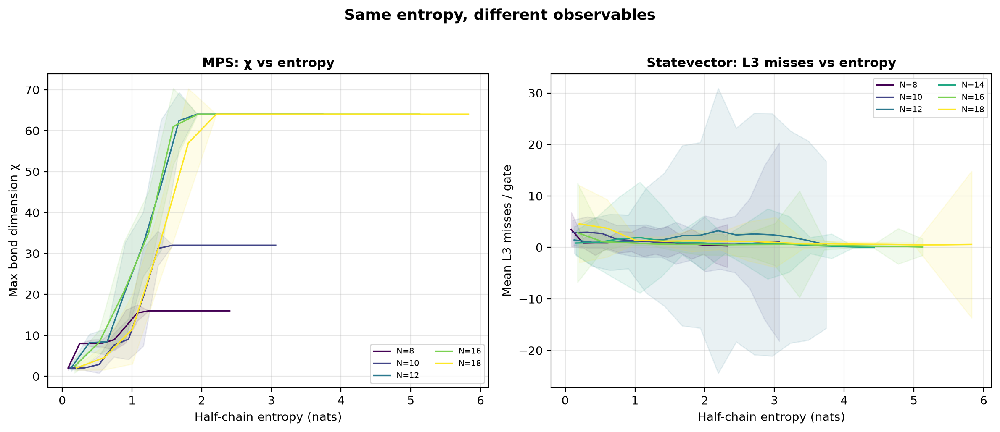

# qert — Quantum Execution Runtime Telemetry

An instrumented quantum simulation runtime designed as a **scientific
observatory** for studying the relationship between quantum entanglement
structure and classical execution behavior.

## Overview

qert is not a production simulator. It does not optimize for speed.
It optimizes for **observability**: every gate application produces a
telemetry event recording execution time, entanglement entropy, and
hardware performance counters (L3 cache misses, TLB misses).

### The Question

**Does entanglement structure leave measurable signatures in classical
execution behavior?**

### The Answer

**It depends on the simulation method.**

- **Statevector simulation:** No. L3 cache misses show no correlation with
  entanglement growth (R² < 0.2, 36,000 runs, 9M events). Cache behavior is
  dominated by circuit layer structure.

- **MPS simulation:** Yes. Bond dimension χ grows with entanglement entropy
  and saturates at the parameter cap or Hilbert space bound. Same circuits,
  same instrument, different observable — different answer.

This validates the instrument: qert detects entanglement effects where they
exist. Their absence in statevector cache behavior is evidence of absence,
not absence of evidence.

## Architecture

```
qert/
├── app
│   ├── main.cpp                # Statevector experiment runner
│   └── mps.cpp                 # MPS experiment runner
├── CMakeLists.txt
├── core
│   ├── include/qert/           # Public headers
│   └── src/                    # Implementation
├── docs
│   └── HYPOTHESIS.md           # Locked hypothesis specification
├── LICENSE.txt
├── Makefile
├── README.md
├── scripts
│   ├── analyze.py              # Statistical pipeline
│   ├── figures.py              # Paper figures
│   ├── parallel.sh             # Parallel process
│   ├── run_mps.sh              # Single process mps simulation
│   ├── single.sh               # Single process statevector simulation
│   ├── sweep_parallel.sh       # Sequential parallel-process sweep
│   └── sweep_single.sh         # Sequential single-process sweep
├── telemetry_schema/           # CSV format specification
└── tests/                      # Catch2 test suite (44 tests, 522 assertions)
```

## Quick Start

### Prerequisites

```bash
make dev-install
```

### Build

```bash
# Release build with tests
cmake -B build -G Ninja -DCMAKE_BUILD_TYPE=Release -DBUILD_TESTING=ON
cmake --build build

# With PAPI hardware counters
cmake -B build -G Ninja -DCMAKE_BUILD_TYPE=Release \
    -DBUILD_TESTING=ON -DENABLE_PAPI=ON
cmake --build build

# Run tests
ctest --test-dir build --output-on-failure
```

### Run an experiment

```bash
# Statevector
./build/qert --num-qubits 16 --depth 48 --seed 42 \
    --mapping lexicographic --output run.csv

# MPS bond dimension
./build/qert_mps --num-qubits 16 --depth 48 --chi-max 64 \
    --seed 42 --mapping lexicographic --output run.csv
```

### Run a sweep

```bash
# Sequential single-process (for cache measurements)
bash scripts/single.sh 16 lexicographic 100

# Parallel (for entropy-only measurements)
bash scripts/parallel.sh 16 lexicographic 100
```

### Analyze results

```bash
# Statevector only
python scripts/analyze.py --statevector results/statevector/ --output figures/

# Statevector + MPS comparison
python scripts/analyze.py --statevector results/statevector/ \
    --mps results/mps/ --output figures/
```

## Key Findings

### Entropy saturation (Phases 1 & 2, 38,400 runs)

- Half-chain entropy saturates at α ≈ 1.60 (N=4-18, Phase 1) to
  α ≈ 2.0-2.5 (N=8-18, Phase 2) times the Page time
- No convergence toward α = 1.0
- lexicographic and gray mappings agree; locality_aware (bit-reversal)
  breaks brickwall coupling and is excluded from invariant analysis

### Cache-entanglement correlation (Phase 2, 36,000 runs, 9M events)

- **No correlation found.** Saturation model fails for cache data:
  R² < 0.2 for N ≥ 10 with 2,000 seeds per condition
- Cache behavior is dominated by circuit layer structure

### MPS validation (5,000 runs)

- Bond dimension χ grows with entanglement entropy, saturates at cap
- Validates instrument sensitivity: qert detects entanglement effects
  where they exist



## Dependencies

| Dependency | Version | Required | Notes |
|-----------|---------|----------|-------|
| C++17 | — | Yes | |
| CMake | ≥ 3.16 | Yes | |
| Eigen | 3.4.1 | Yes | Fetched automatically via CMake |
| PAPI | ≥ 7.3 | Optional | `ENABLE_PAPI=OFF` for stubs |
| Catch2 | 3.15.0 | Tests | Downloaded automatically |
| Python | ≥ 3.10 | Analysis | numpy, matplotlib |

## Supported Platforms

| Platform | Compiler | Status |
|----------|----------|--------|
| Ubuntu 24.04 | GCC 13-15, Clang 18 | ✅ Full support |
| macOS | Apple Clang | ✅ Builds and tests pass |
| Windows | MSVC | ✅ Builds and tests pass |

## Reproducibility

Every output file is self-describing: the first line contains a JSON
metadata header with circuit identity, build identity, platform identity,
and three deterministic FNV-1a 64-bit hashes for experiment fingerprinting.

Two runs with the same `physics_hash` test the same scientific condition
regardless of platform or build environment.

## Paper

[qert paper](https://kvernet.com/qert/)

## Citation

```bibtex
@misc{qert2026,
  title={{qert}: Quantum Execution Runtime Telemetry},
  author={Kinson Vernet},
  year={2026},
  howpublished={\url{https://github.com/kvernet/qert}}
}
```

## Related Repositories

[qert-data](https://github.com/kvernet/qert-data) — Dataset

## License

MIT License. See `LICENSE` file.